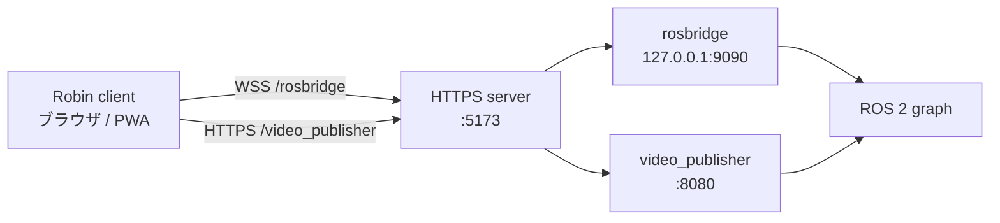

# Robin

Robin は、同一 LAN 上のブラウザから ROS 2 ロボットを操作・監視するための Web クライアントです。ROS トピックの送受信、カメラ映像の WebRTC 配信、地図表示、Nav2 ゴール送信、アーム操作をまとめています。

## 構成


```mermaid
flowchart LR
    Client["Robin client<br>ブラウザ / PWA"]
    Server["HTTPS server<br>:5173"]
    Bridge["rosbridge<br>127.0.0.1:9090"]
    Video["video_publisher<br>:8080"]
    ROS["ROS 2 graph"]

    Client -->|"WSS /rosbridge"| Server
    Client -->|"HTTPS /video_publisher"| Server
    Server --> Bridge
    Server --> Video
    Bridge --> ROS
    Video --> ROS
```

| ディレクトリ | 役割 |
| --- | --- |
| `robin/` | ROS 2 ノード。カメラ映像配信と LeRobot 形式のトピック記録 |
| `launch/` | rosbridge、映像配信、HTTPS サーバーの一括起動 |
| `server/` | ロボット上で動く HTTPS リバースプロキシと証明書案内ページ |
| `client/` | Vue 製の操作画面。サーバーとは別に配信する |

## 通常起動

### 1. 前提

- Ubuntu 上に ROS 2 と `colcon` がインストールされていること
- このリポジトリが colcon ワークスペースの `src/` 以下にあること
- ロボットが、操作端末と同じ LAN に接続されていること
- ROS 2 の環境を source 済みであること

以降では、ワークスペースを `~/robin_ws`、リポジトリを `~/robin_ws/src/robin` とします。

### 2. 初回セットアップ

```bash
source /opt/ros/<distro>/setup.bash
cd ~/robin_ws/src/robin
./setup.sh
```

`setup.sh` は必要に応じて確認を挟みながら、次を行います。

- Bun、mkcert、rosbridge と ROS 依存パッケージの確認・導入
- `server/` の依存パッケージ導入
- ロボットの LAN IP に対する HTTPS 証明書の生成
- サーバー用ランディングページのビルド
- 起動時に使う `~/.config/robin/runtime.conf` の生成
- 一時サーバーの起動と、操作端末へのルート CA 導入案内

表示された URL または QR コードを操作端末で開き、`rootCA.pem` をインストールして信頼を有効にしてから、ターミナルの確認に答えてください。証明書の導入は通常、端末ごとに初回だけ必要です。

### 3. ROS パッケージをビルド

```bash
cd ~/robin_ws
colcon build --symlink-install --packages-select robin
source install/setup.bash
```

新しいターミナルで起動する場合は、ROS 2 本体とワークスペースの両方を source してください。

```bash
source /opt/ros/<distro>/setup.bash
source ~/robin_ws/install/setup.bash
```

### 4. 起動

```bash
ros2 launch robin robin.launch.py
```

このコマンドは以下をまとめて起動します。

- rosbridge WebSocket: `127.0.0.1:9090`
- カメラ映像の WebRTC シグナリング: `0.0.0.0:8080`
- HTTPS サーバー: `0.0.0.0:5173`

終了は `Ctrl+C` です。映像配信ノードまたは HTTPS サーバーが異常終了した場合も、launch 全体が終了します。

### 5. 操作端末から接続

1. 操作端末をロボットと同じ LAN に接続します。
2. `https://<ロボットのIP>:5173` を開き、サーバーがオンラインであることを確認します。
3. [Robin client](https://robin.pylot-robotics.org) を開きます。
4. Settings の **Robin Server Local IP** にロボットの IP を入力して保存します。
5. Settings の **Camera Topic** と **Log Topic** を使用する ROS トピックに合わせます。

クライアントは保存した IP から、`wss://<IP>:5173/rosbridge` と `https://<IP>:5173/video_publisher` を組み立てます。ブラウザから `9090` と `8080` へ直接接続する必要はありません。

## 主な ROS インターフェース

| 名前 | 方向 | 型・用途 |
| --- | --- | --- |
| `/joy` | publish | `sensor_msgs/msg/Joy`。コントローラー表示中に 30 Hz で送信 |
| `/robin/video_publisher_subscribe_topic` | publish | `std_msgs/msg/String`。映像元の Image トピックを切り替える |
| 選択した Camera Topic | subscribe | `sensor_msgs/msg/Image`。WebRTC 映像の入力 |
| 選択した Log Topic | subscribe | 型を rosapi から解決して画面に表示 |
| `/map`, `/scan`, `/tf`, `/tf_static` | subscribe | 地図、LiDAR、座標変換の表示 |
| `/initialpose` | publish | 地図上で指定した初期姿勢 |
| `/navigate_to_pose` | action | Nav2 ゴール。既定型は `nav2_msgs/action/NavigateToPose` |
| `/luna_arm_custom_ik_pose_commander/target_delta` | publish | アーム操作の移動量 |

地図画面は複数の一般的な costmap／global path トピック名を順に探索します。利用可能な機能は、接続先ロボットが公開しているトピックと action に依存します。

## 開発

サーバー側を通常構成で動かしたまま、クライアントだけを開発起動できます。

```bash
cd ~/robin_ws/src/robin/client
bun install --frozen-lockfile
bun run dev
```

`http://localhost:5174` を開き、Settings でロボットの IP を設定します。固定の接続先をビルド時に埋め込む場合は `VITE_ROBIN_SERVER_URL=https://<IP>:5173` を設定できます。

サーバーを単独で開発起動する場合は、証明書生成後に以下を実行します。rosbridge と `video_publisher` は別途起動が必要です。

```bash
cd ~/robin_ws/src/robin/server
bun install --frozen-lockfile
bun run create_certificate
bun run dev
```

コンポーネント固有の詳細は [client/README.md](client/README.md) と [server/README.md](server/README.md) を参照してください。

## ビルドと確認

```bash
# ROS 2 package
cd ~/robin_ws
colcon test --packages-select robin
colcon test-result --verbose

# Client
cd ~/robin_ws/src/robin/client
bun run build

# Server
cd ~/robin_ws/src/robin/server
bun run typecheck
bun run build
```

## LeRobot トピックレコーダー

任意の ROS 2 トピックを Parquet に記録するノードも含まれています。

```bash
ros2 run robin lerobot_recorder --ros-args \
  -p topic_name:=/joint_states \
  -p output_dir:=./lerobot_dataset \
  -p task_name:=joint_capture \
  -p episode_index:=0
```

既定の制御トピック `/lerobot_recorder/config` に `std_msgs/msg/String` の JSON を送ると、実行中に対象トピックや出力先を変更できます。

```bash
ros2 topic pub --once /lerobot_recorder/config std_msgs/msg/String \
  "{data: '{\"topics\":[\"/joint_states\",\"/joy\"],\"episode_index\":1}'}"
```

出力先には `meta/` と `data/chunk-000/episode_XXXXXX.parquet` が作成されます。ノード終了時または episode 切り替え時に episode メタデータが確定します。

## トラブルシューティング

- **`Robin server configuration is missing`**: リポジトリ直下で `./setup.sh` を再実行してください。
- **証明書エラーになる**: `https://<IP>:5173` を直接開き、ルート CA の導入と完全な信頼を確認してください。
- **ロボットの IP が変わった**: 証明書はセットアップ時の IP に対して生成されます。`./setup.sh` を再実行してください。
- **IP を自動検出できない**: `ROBIN_SERVER_HOST=<IPv4>` を設定して `./setup.sh` を実行できます。
- **`5173` が使用中**: 既存の Robin サーバーや別の Vite プロセスを停止してください。サーバーは strict port で起動します。
- **ROS に接続できない**: `ros2 node list` で ROS graph を確認し、`ros2 launch` のターミナルに rosbridge の起動エラーがないか確認してください。
- **映像が出ない**: Settings の Camera Topic が存在し、型が `sensor_msgs/msg/Image` で、画像が継続的に publish されているか確認してください。
